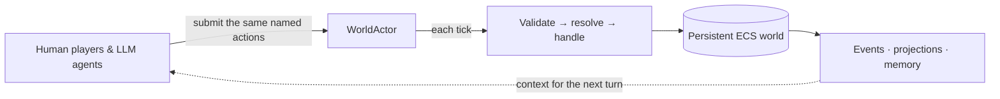

# Bunnyland

<p align="center">
  <a href="https://bunnyland.dev/">
    
  </a>
</p>

> Build a world, hand its characters to humans or AI agents, and watch a shared story take
> on a life of its own.

Bunnyland is an asynchronous social sandbox for persistent characters and emergent
simulation. Start with a cozy town, a working colony, a doomed starship, or another
ready-to-play world; then explore it through the web, a terminal, Discord, or an LLM agent.
Every character inhabits the same world and plays by the same rules.

Under the hood, human players and Ollama- or OpenRouter-backed agents act through one verb
surface (`move`, `take`, `eat`, `say`, `take-note`, …). Bunnyland validates their actions
identically, persists the results in the [Relics](https://github.com/ssube/relics) ECS
database, and lets small plugin-owned systems turn those results into consequences.

🌐 **Curious what that looks like?** [Visit bunnyland.dev](https://bunnyland.dev/) for the
visual tour, playable clients, and player guides—or jump into the quickstart below to run
your own world.

### One world, one action surface



## 🚀 Quickstart

```bash
uv sync                     # core install
uv run bunnyland serve --ticks 5     # generate a world, simulate 5 rounds (offline)
```

That runs entirely offline with a deterministic world and characters that simply wait. To
have characters actually *think*, add an LLM (see below):

```bash
uv sync --extra llm
echo 'OLLAMA_CLOUD_API_KEY=sk-...' > .env
uv run bunnyland serve --llm --generator recursive --ticks 20
```

Ollama is the default provider. OpenRouter can drive character controllers and world
generation with `--llm-provider openrouter`, `--worldgen-provider openrouter`, and
`OPENROUTER_API_KEY`; see [Running a server](docs/admin/running-a-server.md#connecting-an-llm).

## Docker Compose

The checked-in Compose files are deployment building blocks, not a credential generator.
A private `compose.user.yml` must mount an Argon2 `auth-users.yml` file read-only and persist
`/data/auth-tokens.sqlite3`; without that token store, protected HTTP and WebSocket routes
fail closed. The API is exposed only through the same-origin frontend proxy.

Hosted VPS setup is managed by the `bunnyland-vps` Ansible playbook. The retired
`scripts/vps-docker-setup` command exits without changing the host. See the
[VPS administration guide](docs/admin/vps-admin-setup.md) for credential provisioning,
bearer-token verification, encrypted backup, and rollback requirements. For a direct local
server, follow [Running a server](docs/admin/running-a-server.md).

CI publishes one `ghcr.io/thalismind/bunnyland-server` image on pushes to `main`, with
branch tags and `latest` for the default branch. It includes all optional extras and uses
the same `bunnyland` command as a native installation. Running it without a subcommand
prints help instead of creating a world:

```bash
docker run --rm ghcr.io/thalismind/bunnyland-server
docker run --rm -p 8765:8765 ghcr.io/thalismind/bunnyland-server serve \
  --generator lifesim-demo --ticks 0 --api-host 0.0.0.0 --api-port 8765
docker run --rm -it ghcr.io/thalismind/bunnyland-server tui \
  --server https://your-bunnyland.example
docker run --rm -it ghcr.io/thalismind/bunnyland-server repl \
  --server https://your-bunnyland.example
docker run --rm -it ghcr.io/thalismind/bunnyland-server chat \
  --server https://your-bunnyland.example/v1
```

Use `-it` for the terminal clients. The web repo publishes
`ghcr.io/thalismind/bunnyland-web` with the same tag scheme.

## Observability

Bunnyland can export **OpenTelemetry traces and metrics** so you can watch a live world in
Grafana/Tempo, Jaeger, or any OTLP backend. Distributed traces span the game tick → command
dispatch → handler → LLM decision (plus auto-instrumented HTTP requests), alongside world
metrics: entity/character/room counts, tick cadence, command accept/reject rates, handler and
LLM-decision latency, LLM input/output token usage, and provider-reported LLM cost when the
SDK/API exposes it. It is **off by default** — install the `otel` extra and set
`BUNNYLAND_OTEL_ENABLED`:

```bash
uv sync --extra otel
BUNNYLAND_OTEL_ENABLED=1 OTEL_EXPORTER_OTLP_ENDPOINT=http://localhost:4317 \
  uv run bunnyland serve --llm --ticks 0
```

The Compose stack ships an optional single-container [Grafana Tempo](https://grafana.com/oss/tempo/)
backend (`compose.tempo.yml`). See
[Observability](docs/admin/running-a-server.md#observability-opentelemetry) for the full
metric/span reference and the Tempo setup.

## 📚 Documentation

### Player guides

- **[Getting started](docs/player/getting-started.md)** — the first few turns and where
  to go next.
- **[Client guides](docs/player/clients/README.md)** — choosing and using the terminal
  TUI, terminal REPL, Web REPL, and Bunnyland Toon clients.
- **[Running your own game](docs/player/running-your-own-game.md)** — running a private,
  semi-single-player server, saving it, and generating a fresh world.
- **[Movement and looking](docs/player/movement-and-looking.md)** — room summaries,
  narration, visible targets, exits, and movement.
- **[Inventory and use](docs/player/inventory-and-use.md)** — take, drop, put, hold,
  wear, use, unlock, open, close, write, rest, wait, and talk.
- **[Hunger and thirst](docs/player/hunger-and-thirst.md)** — eating, drinking,
  consumables, renewable water sources, and need decay.
- **[Focus, notes, and memories](docs/player/focus-notes-and-memories.md)** — private
  notes, remember, reflect, contextual recall, and forget.
- **[Core actions](docs/player/core-actions.md)** — a compact reference for shared verbs.
- **[Daily needs](docs/player/daily-needs.md)** — fatigue, hygiene, comfort, fun, social
  contact, privacy, safety, and self-care actions.
- **[Environment and mechanisms](docs/player/environment-and-mechanisms.md)** — how to use
  doors/buttons and handle fire.
- **[Social play and boundaries](docs/player/social-and-boundaries.md)** — how speech,
  relationships, and policy boundaries affect play.
- **[Storyteller incidents](docs/player/storyteller-incidents.md)** — how to notice and
  resolve active incidents.
- **[Garden-sim farming](docs/player/gardensim.md)** — finding soil, planting seeds,
  watering crops, harvesting produce, and selling it.
- **[Farm production](docs/player/farm-production.md)** — edible produce, machines,
  animals, fishing, mining, foraging, gifts, festivals, and bundles.
- **[Colony-sim work and ownership](docs/player/colonysim.md)** — reservations, resources,
  crafting, jobs, and durable ownership.
- **[Colony health and work](docs/player/colony-health-and-work.md)** — priorities,
  allowed areas, room quality, medicine, recovery, wealth, and mental states.
- **[Barbarian-sim combat and survival](docs/player/barbariansim.md)** — challenges,
  attacks, repairs, fortifications, poison, corruption, purge readiness, rituals, danger
  zones, treasure, and pickpocketing.
- **[Dragon-sim exploration and quests](docs/player/dragonsim.md)** — discovering
  locations, tracking and branching quests, persuasion, crime reports, fixed magic, and
  factions.
- **[Life-sim homes, work, and family](docs/player/lifesim.md)** — aspirations, skills,
  jobs, businesses, households, homes, room claims, rent, and family.
- **[Dagger-sim adventuring and institutions](docs/player/daggersim.md)** — rumors, travel, institutions,
  banking, law, property, magic, afflictions, and dungeons.
- **[Dagger civic life and property](docs/player/dagger-civic-property.md)** —
  institution reputation, service access, generated work, legal reputation, banking, and
  purchasable deeds.
- **[Void-sim ships and space travel](docs/player/voidsim.md)** — airlocks, life support,
  power, docking, fuel, sensors, orbit, landing, crew pressure, emergencies, contracts,
  and jumps.
- **[Void contracts, fabrication, and salvage](docs/player/void-contracts-fabrication.md)** —
  resource-backed fabrication, cargo, salvage claims, and crew watches.
- **[Nuke-sim wasteland survival](docs/player/nukesim.md)** — radiation, mutation
  pressure, scavenging, hotspots, samples, old-world artifacts, field repairs, chems,
  settlement salvage, old-world tech, and dirty water.
- **[Nuke settlements and old-world tech](docs/player/nuke-settlements-tech.md)** —
  claiming settlements, salvage, purifiers, generators, and device restoration.
- **[Dino-sim fossils, eggs, companions, and kaiju incidents](docs/player/dinosim.md)** —
  identifying fossils, cloning eggs, hatching dinos, taming companions, and handling kaiju
  storyteller incidents.
- **[Dino ranching, feed, and creature products](docs/player/dino-ranching-products.md)** —
  feed stores, resource-backed feed, hunger and stress, egg collection, product harvests,
  ranch work, and guard duty.
- **[Neon-sim cyberpunk city](docs/player/neonsim.md)** — districts and access control,
  surveillance and evidence, and hacking with counter-intrusion traces.
- **[Neon streets, cyberware, and fixers](docs/player/neon-streets-and-fixers.md)** — the
  street economy, heat and wanted levels, cybernetic implants, and fixer missions with
  corporate intrigue.

### Technical docs

- **[The Vision](docs/developer/vision.md)** — what bunnyland is trying to be, and what belongs in
  core, plugins, clients, scripts, and content libraries.
- **[Bunnyland 1.x compatibility](docs/developer/compatibility.md)** — supported Python,
  transport, MCP, public import, and persisted-world guarantees.
- **[World Contract v1](docs/developer/world-contract-v1.md)** — normative tick, mutation,
  persistence, perspective, and streaming boundaries for the controlled preview.
- **[Authorization surfaces](docs/developer/authorization-surfaces.md)** — shared scope,
  transport, addon, and testing conventions for HTTP, WebSocket, and MCP.
- **[Technical results](docs/developer/technical-results.md)** — dated controller-contract,
  provider, load, stream, restore, and release-validation evidence.
- **[Running a server](docs/admin/running-a-server.md)** — install, the `serve` loop, the time
  model, and connecting Ollama or OpenRouter.
- **[Generating worlds](docs/admin/generating-worlds.md)** — choosing generators, using the
  web generator page, and replacing a running world through the admin API.
- **[VPS Docker setup](docs/admin/vps-admin-setup.md)** — Linux VPS deployment with the
  containerized server/frontend stack, Let's Encrypt, admin auth, LLM providers, and Discord bot
  wiring.
- **[Host dev setup](docs/admin/host-dev-setup.md)** — older non-container host setup for
  development and debugging.
- **[World creation](docs/developer/world-creation.md)** — generators (`oneshot` vs `recursive`),
  seeds, how generation stays inside the rules, and adding your own generator.
- **[Discord bot](docs/admin/discord-bot.md)** — creating the bot, the token, inviting it,
  wiring a user to a character, and the player commands.
- **[MCP server](docs/admin/mcp-server.md)** — mounting the HTTP MCP endpoint on the
  existing API port for agentic clients.
- **[MCP local coding-agent setup](docs/admin/mcp-local-agent.md)** — enabling MCP on a
  local or VPS server, configuring a workstation agent, and validating the claim/play/release loop.
- **[Admin & controllers](docs/admin/)** — claiming, suspending, and handing off
  characters; enabling/disabling plugins.
- **[Saving & reloading](docs/developer/persistence.md)** — save/autosave/reload a world, and what
  is (and isn't) persisted.
- **[World-as-a-database modeling](docs/developer/world-database-modeling.md)** — choosing
  components, edges, linked entities, and bounded relational queries.
- **[Scripting catalogue](docs/bunnyland_scripting.md)** — external JSON scripts for deterministic
  tests, plugin scenarios, and scripted events.

The full design is in [`bunnyland_specification.md`](docs/bunnyland_specification.md).

## 🧩 Simulation packages

Mechanics ship as **plugins** you enable per world, so a world is whatever bundle you turn
on. Each sim package adds its own components, verbs, systems, and prompt fragments without
touching the others — emergence comes from small systems reacting to shared events. The
full catalogue is in [`bunnyland_mechanics.md`](docs/bunnyland_mechanics.md), with plugin
IDs and out-of-tree plugin notes in [`PLUGINS.md`](PLUGINS.md).

| Package         | Status      | Inspired by      | Key mechanics it introduces |
|-----------------|-------------|------------------|-----------------------------|
| **Life Sim**    | Implemented | The Sims, inZOI, Paralives | Needs, moods/thoughts, social bonds and jealousy, romance, family and pregnancy, skill progression, careers and household economy |
| **Colony Sim**  | Implemented | RimWorld, Oxygen Not Included | Work priorities and jobs, resource gathering, crafting recipes and workstations, ownership and reservations |
| **Garden Sim**  | Implemented | Stardew Valley, Farming Simulator | Soil and tilling, planting/watering/fertilizing, seasonal crop growth, harvesting, tree tapping, and sap collection |
| **Barbarian Sim** | Implemented | Conan Exiles, Valheim, Enshrouded | Survival combat, stamina, temperature exposure, gear durability, survival gaps, buildings, purges, rituals, danger zones, bosses, treasure, poison and corruption |
| **Dragon Sim**  | Implemented | Skyrim, The Witcher 3, Dragon Age: Inquisition, Kingdom Come: Deliverance | Open-world discovery, radiant quests and objectives, quest tracking and branching, factions, reputation, persuasion, crime reports, fixed magic, artifacts, and ancient beast options |
| **Dagger Sim**  | Implemented | Daggerfall, Caves of Qud, Darklands, ADOM, Ultima VII | Procedural frontier expansion, rumors, travel logistics, guilds/institutions and services, banking and debt, civic law and fines, custom classes and spells, language pacification, supernatural afflictions, procedural dungeons, etiquette and social approach |
| **Void Sim**    | Implemented | FTL              | Ships, stations and habitat modules, life support, pressure and airlocks, power grids, ship-system repair, docking, crew morale and mutiny, drones and ship AI, xenobiology, emergencies, passengers, customs, mining, insurance, and mortgages |
| **Nuke Sim**    | Implemented | Fallout, S.T.A.L.K.E.R., Metro, Wasteland | Radiation sources and shielding, mutation pressure, hotspots, suppressants, samples, locked crates, faction salvage, old-world artifacts and tech, schematics, field repair, chem brewing, beacons, trader routes, raider pressure, and terminals |
| **Neon Sim**    | Implemented | Deus Ex, Watch Dogs, Cyberpunk 2077, Blade Runner, Shadows of Doubt, Shadowrun, Syndicate | Cyberpunk districts and access control, usable surveillance and evidence, ECS hacking with counter-intrusion traces, street economy with heat/wanted levels, cybernetic implants, and fixer missions with corporate intrigue |
| **Dino Sim**    | Implemented | Jurassic Park, Jurassic World Evolution, ARK, Dino Crisis, Pacific Rim, Monster Hunter, Palworld | Fossil/species identification and cloning, fossil survey and preparation, lab incubation, egg inspection, imprinting, juvenile care, brooding, water creature study, containment panic, tracking, taming, companion commands, enclosures and escapes, and kaiju storyteller incidents |
| **Fortress Sim** | Planned, out of current parity scope | Dwarf Fortress   | Deep materials, world history, civilizations, artifacts, nobles, justice, institutions, tantrum spirals, and multi-site worlds |

Foundational plugins back these up: **Environment** (time, weather, fire), **Mechanisms**
(doors, buttons), **Social Bonds**, **Policy & Boundaries**, **Persona**, **Storyteller**
(paced incidents), **Memory** (private notes and recall), **Prompt Filters** (stackable
post-render text transformations), and **World Generators**.

Each implemented sim package ships a ready-to-play example world that shows off its
mechanics (and the life-sim needs every character shares). Spin one up with its
`<sim>-demo` generator:

```bash
uv run bunnyland serve --generator voidsim-demo --ticks 5
```

The demos are `lifesim-demo`, `gardensim-demo`, `maple-farm-demo`, `colonysim-demo`,
`barbariansim-demo`, `dragonsim-demo`, `daggersim-demo`, `voidsim-demo`, `nukesim-demo`,
`neonsim-demo`, and `dinosim-demo`.
Fast travel and richer map features remain planned follow-up work rather than part of the
current implemented parity surface.
The public demo progression is `apple-crossing` (first-run Hungry Courier tutorial),
`bell-green` (small-town sandbox), and `clover-city` (dense city-block showcase).
There is also a larger life-sim showcase, `apartment-demo`: a quirky NYC apartment
building of eccentric tenants with backstories, homes, and daily routines, a rat-man in
the warren below, and hidden corners.
For lighter genre-spoof setups, the worldgen plugin also ships `clue-snack-demo`,
`dive-scheme-demo`, `star-opera-demo`, `gothic-count-demo`, and `midnight-burger-demo`
(an inner-city burger shack that opens at dusk and rolls into night through the world's
day/night cycle, with a hungry night cook and a hidden cellar that is only dangerous
after dark), all using new names, locations, and props.
For hand-crafted dungeon-crawler setups, use `dungeon-vault-demo`, `dungeon-maze-demo`,
or `dungeon-crypt-demo`. These are small deterministic crawls with room maps, secrets,
readable clues, food, water, and dungeon objectives.
For atmospheric scene vignettes that lean on the shared environment and weather mechanics,
the worldgen plugin ships `storm-lighthouse-demo` (a coastal lighthouse in an autumn squall
with a beacon to keep fueled and a wrecker's secret under the lens), `vacancy-motel-demo`
(a roadside motel where Room 6 only opens after dark and the night clerk gets hungry), and
`frozen-greenhouse-demo` (a greenhouse dome on a frozen plain with crops to keep warm and a
specimen that grows too fast in the dark and cold), `stuck-subway-demo` (a subway car
stalled between stations with dim power, dead ventilation, a dead motor, and strangers
waiting out the hold), `midnight-laundromat-demo` (a 24-hour laundromat drifting from
night toward dawn, with late-night strangers and a lost-and-found nobody remembers filling),
and `county-fair-demo` (closing night of an autumn county fair with a pie contest, a prize
pumpkin, a smug rival, and a blue ribbon still up for grabs).
The `fortresssim` package is a planned catalogue package and does not have a plugin or demo
generator yet.

## Development

```bash
scripts/test-all
uv run ruff check src tests
```

Use `scripts/test-all` for the default test run. It delegates to `scripts/test-coverage`,
which runs `uv run -m pytest` with coverage. Use module-form pytest instead of
`uv run pytest`; with some `uv` environments the console entrypoint can run without the
same import path as the module form, which shows up as missing installed dependencies such
as `relics`.

Optional live LLM checks are marked and skipped by default. They load `.env` before
checking credentials. To exercise real Ollama and OpenRouter SDK calls, install the `llm`
extra, set `BUNNYLAND_LIVE_LLM=1` plus `OLLAMA_HOST` or `OLLAMA_CLOUD_API_KEY` and/or
`OPENROUTER_API_KEY`, then run:

```bash
uv run -m pytest -m live_llm
```

`tests/test_e2e.py` is the best place to see the whole stack exercised: generate a world,
check it matches both the proposal and the agent's prompt, then play several rounds and
assert each action is processed.

## 🎮 Clients

Bunnyland is played through several clients. The web graph and web toon clients ship from
the separate frontend/web repo; the rest ship from this repo. *Offline* means the client can
host a world in its own process with no network port; *Over HTTP* means it can drive a
running server through the web controller; *Role* is whether it can act in the world or only
observe it.

| Client | Role | Offline | Over HTTP | Agent-driven | 2D graphics | ASCII / rich text | Clickable targets |
|--------|------|:------:|:--------:|:------------:|:-----------:|:-----------------:|:-----------------:|
| Web graph †                       | Spectator | | ✓ | | ✓ (world graph) | | ✓ |
| Web toon †                        | Playable  | | ✓ | | ✓ (sprites)     | | ✓ |
| Discord bot                       | Playable  | ✓ ‡ | | | | ✓ | |
| MCP endpoint                      | Playable  | | ✓ | ✓ | | | |
| Terminal TUI (`uv run --all-extras bunnyland tui`)   | Playable  | ✓ | ✓ | | | ✓ | ✓ |
| Terminal REPL (`uv run --all-extras bunnyland repl`) | Playable  | ✓ | ✓ | | | ✓ | ✓ |
| Terminal chat (`uv run --all-extras bunnyland chat`) | Playable  | ✓ | ✓ | | | ✓ | ✓ |

† Implemented in the frontend/web repo; capabilities summarized here.
‡ The Discord bot hosts the world in its own process.

## Optional extras

| Extra      | Enables                                  | Install                      |
|------------|------------------------------------------|------------------------------|
| `llm`      | Ollama/OpenRouter world generation and character agents | `uv sync --extra llm` |
| `discord`  | the Discord player front-end             | `uv sync --extra discord`    |
| `mcp`      | HTTP MCP endpoint for agentic clients    | `uv sync --extra mcp`        |
| `chroma`   | ChromaDB vector memory store             | `uv sync --extra chroma`     |
| `tui`      | the Textual terminal client (`bunnyland tui`) | `uv sync --extra tui`   |
| `repl`     | the Textual REPL client (`bunnyland repl`), local or over HTTP | `uv sync --extra repl` |
| `otel`     | OpenTelemetry metrics/traces export (off by default; set `BUNNYLAND_OTEL_ENABLED`) | `uv sync --extra otel` |
